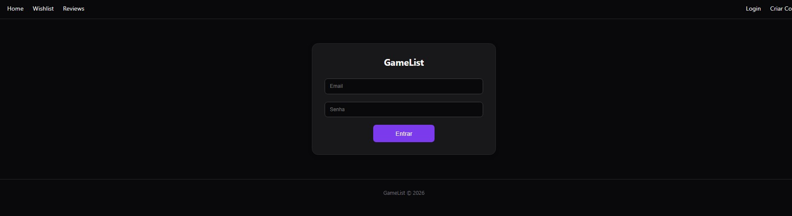
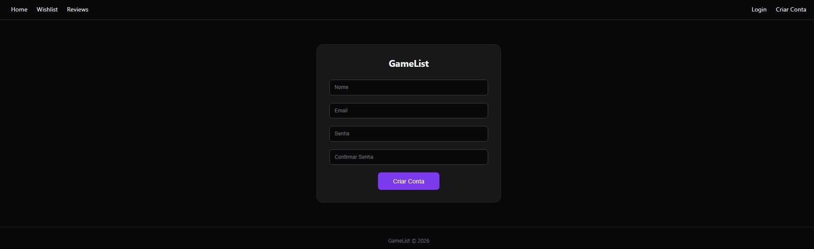
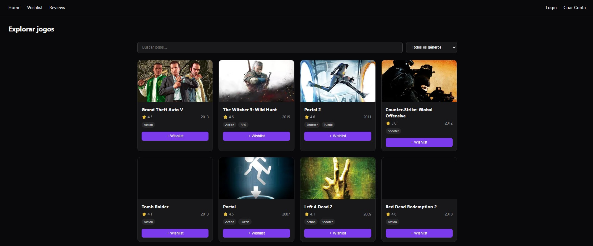
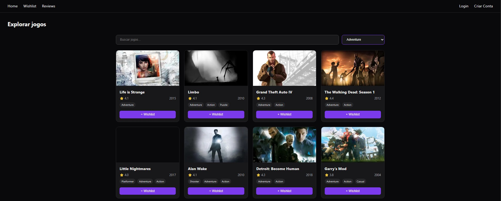
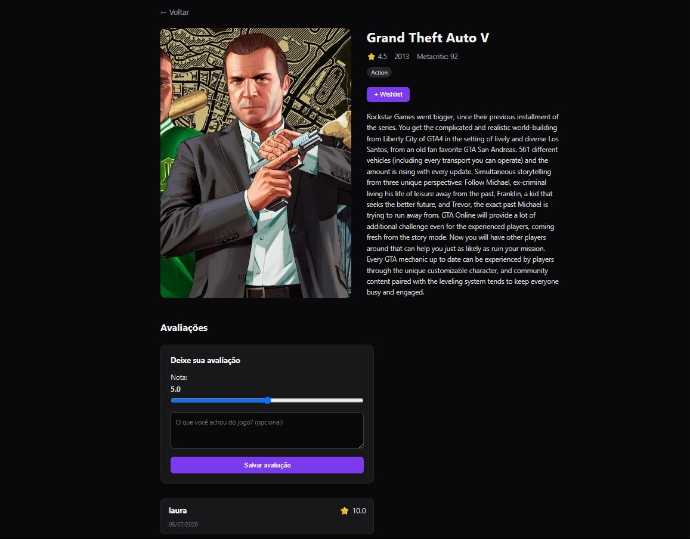
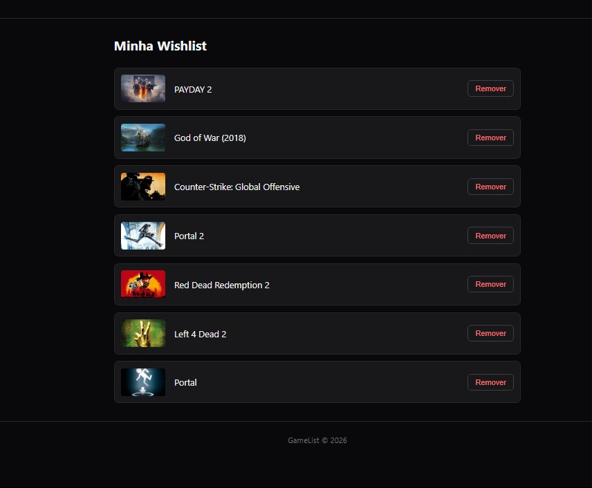
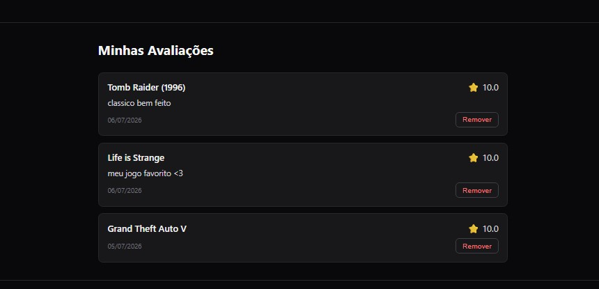
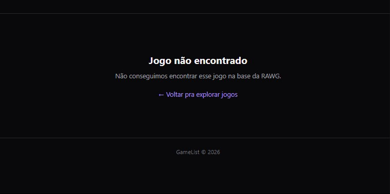

# GameList

Web application to search for games, manage a wishlist and rate games, while also seeing other users' ratings.

Final project for the Web Programming course (XDES03).

## Project description

GameList lets you find information about games, save the ones you want to play later, and see what other people think before deciding what to play.

The application allows you to:

- **Search games** by name, with genre filter and pagination, using real data from the RAWG Video Games Database
- **View game details**: cover, rating, release year, genres and description
- **Create an account and log in**
- **Add and remove games** from a personal wishlist
- **Rate a game** (score from 0 to 10 + comment) and **see other users' ratings** for the same game
- **Edit your own rating** at any time

## Technologies used

### Frontend

- Next.js (App Router) with TypeScript
- Zod for form validation
- Sonner for notifications
- Plain CSS for styling

### Backend

- Node.js with Express
- Prisma ORM with SQLite database
- JWT (`jsonwebtoken`) for authentication, with the token stored in an `httpOnly` cookie
- bcrypt for password hashing

### External API

- RAWG Video Games Database: source of the game data (cover, rating, genre, description)

## Screenshots

### Login screen



### Sign-up screen



### Explore games (search, genre filter and pagination)



### Search filtered by genre



### Game details (description, wishlist and ratings)



### My wishlist



### My ratings



### Game not found (error handling)



## How to run the project

### Backend

```bash
cd backend
npm install
npx prisma generate
npx prisma migrate dev
npm run dev
```

Create a `.env` file inside `backend/` with:

```
DATABASE_URL="file:./prisma/app.db"
JWT_SECRET="your-secret-string-here"
```

### Frontend

```bash
cd frontend
npm install
npm run dev
```

Create a `.env.local` file inside `frontend/` with:

```
NEXT_PUBLIC_API_URL=http://localhost:3001
RAWG_API_KEY=your_rawg_key_here
```

The RAWG key is free and can be generated at rawg.io/apidocs.

## Team

| Name | GitHub |
|------|--------|
| Laura Jesus | @LauraJesus |
| Bianca Salvador | |
